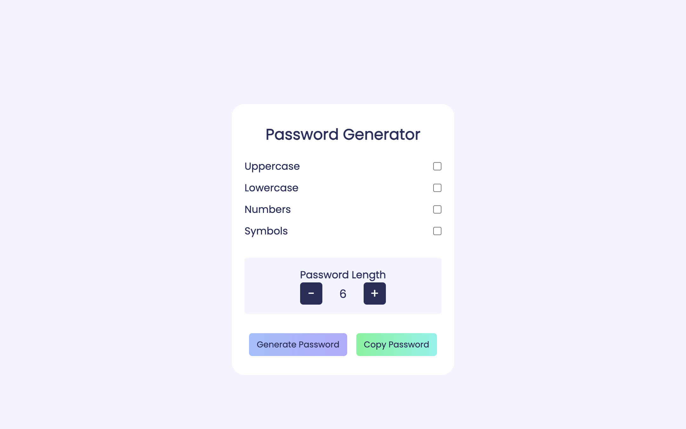

### 1. The Character Limit Tracker

Primary purpose of this project is to monitor and display the character count in a text box in real-time. The application restricts the user from typing more than 100 words and provides immediate feedback if the character limit is exceeded.

<a href='https://github.com/hsynmrzyv/100-JS-Projects/tree/main/1.%20Character%20Limits%20Tracker'>The Character Limit Tracker</a> | <a href='https://characterlimitstracker-1.netlify.app/'>Live Demo</a>

### 2. The Random Color Generator

With just a click of a button, it generates a random color and dynamically changes the background color of the page to that selected color.

<a href='https://github.com/hsynmrzyv/100-JS-Projects/tree/main/2.%20Random%20Color%20Generator'>The Random Color Generator</a> | <a href='https://randomcolorgenerator-2.netlify.app/'>Live Demo</a>

 

### 3. Keyboard Event Logger

This project allows users to explore and understand the different keyboard events by displaying the event.key, event.keyCode, and event.code values on the screen as they press any key on their keyboard.

<a href='https://github.com/hsynmrzyv/100-JS-Projects/tree/main/3.%20Keyboard%20Event%20Logger'>Keyboard Event Logger</a> | <a href='https://keyboardeventlogger-3.netlify.app/'>Live Demo</a>

 

### 4. The Password Generator

<a href='https://github.com/hsynmrzyv/100-JS-Projects/tree/main/4.%20Password%20Generator'>The Password Generator</a> | <a href='https://passwordgenerator-4.netlify.app/'>Live Demo</a>

The Password Generator offers customizable options to create strong and secure passwords.Users can choose from four types of characters to include in the password: uppercase letters, lowercase letters, numbers, and symbols. By selecting or deselecting these options, users can customize the password's complexity to suit their needs.The generator includes a counter that allows users to set the desired password length.

### 5. The Music Finder

<a href='https://github.com/hsynmrzyv/100-JS-Projects/tree/main/5.%20Music%20Finder'>The Music Finder</a> | <a href='https://musicfinder-5.netlify.app/'>Live Demo</a>

This web application allows you to easily search through your list of music and find songs based on the input provided. As you start typing in the search input, the application will dynamically filter and display the songs that match the entered value, making it convenient to locate specific tracks from your collection.

### 6. The Todo List

<a href='https://github.com/hsynmrzyv/100-JS-Projects/tree/main/6.%20To-do%20List'>The Todo List</a> | <a href='https://todolist-6.netlify.app/'>Live Demo</a>

This is a straightforward web application that helps you manage your daily tasks efficiently. With SimpleTodo, you can create a personalized to-do list, add and remove tasks with ease.

### 7. The Todo App

<a href='https://github.com/hsynmrzyv/100-JS-Projects/tree/main/6.%20To-do%20App'>The Todo App</a> | <a href='https://todoapp-7.netlify.app/'>Live Demo</a>

This web application that allows you to manage your daily tasks efficiently. This app comes with a sign-in and sign-up functionality. You can easily add and remove todos, keeping your tasks organized and accessible anytime.

